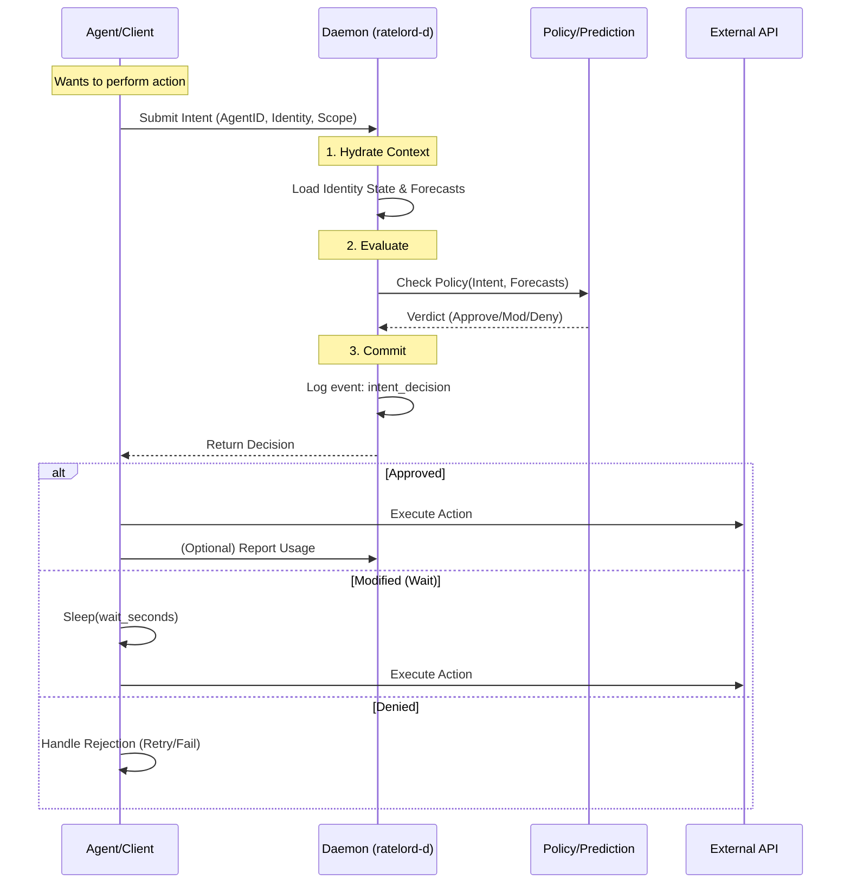
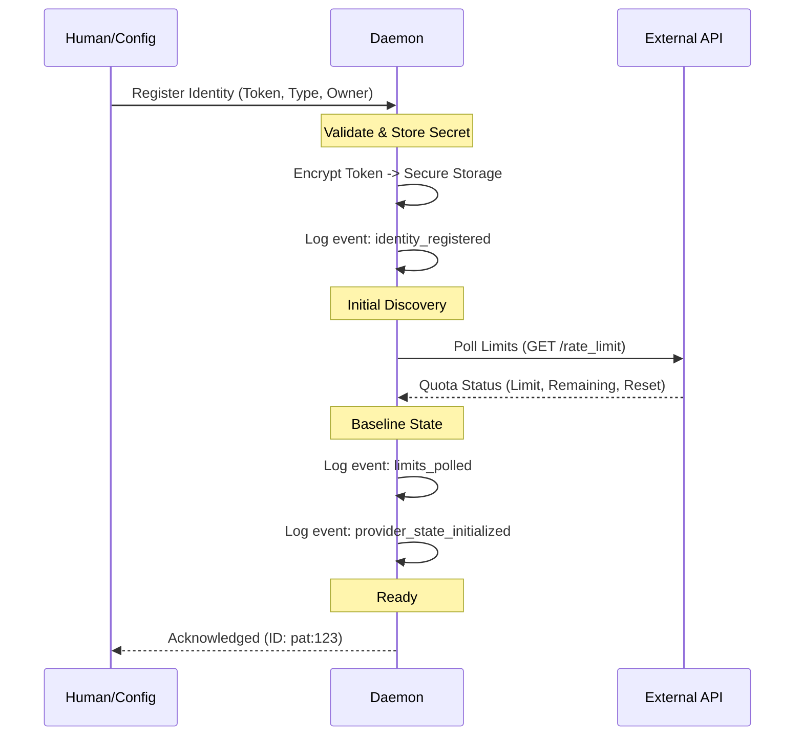
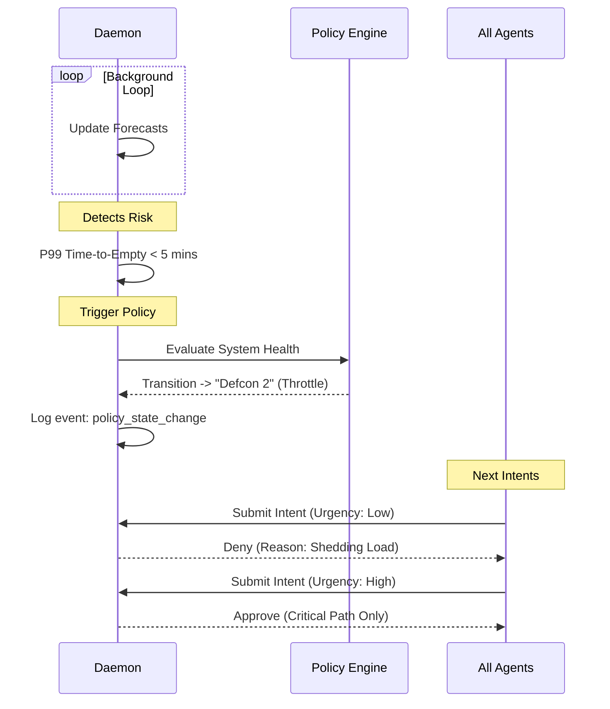

# WORKFLOWS: ratelord

This document defines the critical end-to-end interactions between `ratelord` components. It maps the static structures (Architecture, Agent Contract, Policy Engine) into dynamic processes.

All workflows adhere to the **Daemon Authority** and **Event Sourcing** principles.

---

## 1. Core Workflow: The Negotiation Loop (Ask-Wait-Act)

This is the fundamental interaction loop that runs for every constrained action. It enforces the "Ask Before You Act" mandate.

### 1.1 Diagram

### 1.2 Detailed Steps

1.  **Submission**:
    *   The Agent constructs an **Intent** identifying *who* (AgentID, Identity), *what* (Workload), and *where* (Scope).
    *   It sends this intent to the Daemon via the Unix Socket API (`POST /intent`).

2.  **Daemon Evaluation**:
    *   **Context Loading**: The Daemon retrieves the current state of the requested `Identity` and `Scope` (current usage, remaining budget).
    *   **Forecasting**: The Prediction Engine calculates the `P50` and `P99` time-to-exhaustion if this intent proceeds.
    *   **Policy Check**: The Policy Engine evaluates rules against the Intent + Forecasts.
        *   *Example Rule*: "Deny if P99 exhaustion < 10 mins and Urgency != High".

3.  **Decision & Commitment**:
    *   The Daemon generates a **Decision**: `Approve`, `ApproveWithModifications`, or `Deny`.
    *   **CRITICAL**: The Decision is appended to the Event Log (`intent_decision`) *before* returning to the Agent. This ensures the ledger is the source of truth.

4.  **Agent Execution**:
    *   The Agent receives the Decision.
    *   If `wait_seconds > 0`, the Agent sleeps.
    *   If `Approve`, the Agent calls the external Provider.
    *   If `Deny`, the Agent aborts the call.

---

## 2. Onboarding a New Identity

This workflow registers a new set of credentials (e.g., a GitHub Personal Access Token) with the system, establishing its scope and initial state.

### 2.1 Diagram

### 2.2 Detailed Steps

1.  **Registration**:
    *   Operator uses the CLI or TUI to add an identity: `ratelord identity add --type=github_pat --token=... --scope=org:my-org`.
    *   **Security**: The Daemon receives the token, encrypts it (or stores a reference to an env var), and **never logs the raw token**.

2.  **Scope Assignment**:
    *   The Daemon associates the Identity with specific **Constraint Pools** based on the provider type (e.g., GitHub PATs map to `core`, `search`, `graphql`).

3.  **Initial Polling**:
    *   The Daemon immediately performs a **Poll** against the Provider to establish the baseline.
    *   It records the absolute values (`limit`, `remaining`, `reset_time`) in the Event Log.
    *   *Note*: Without this step, the Daemon cannot calculate burn rates or approve intents.

---

## 3. Handling Exhaustion (The "Red Zone")

How the system detects and mitigates imminent or actual budget exhaustion. This illustrates **Time-Domain Reasoning**.

### 3.1 Diagram

### 3.2 Detailed Steps

1.  **Detection (Predictive)**:
    *   The Prediction Engine constantly updates the "Time to Exhaustion" (TTE) for active identities.
    *   **Trigger**: A forecast (e.g., `P99 TTE`) drops below a safety threshold (e.g., `reset_window_remaining`).

2.  **Alerting & State Change**:
    *   The Daemon emits a `risk_alert` event.
    *   Global or Scope-level variables are updated (e.g., `system_status` changes from `OK` to `WARNING`).

3.  **Throttling (Reactive Defense)**:
    *   **Policy Activation**: Policies referencing `system_status == WARNING` become active.
    *   **Load Shedding**: Low-urgency intents (`background`, `analytics`) are summarily **Denied** to save remaining budget for critical tasks.
    *   **Rate Limiting**: High-urgency intents might receive `ApproveWithModifications` (forced waits) to flatten the curve.

4.  **Recovery**:
    *   As the reset window approaches or load decreases, TTE increases.
    *   When TTE > Safe Threshold, the system reverts to `OK`.

---

## 4. Policy Update & Hot-Reload

How the operator changes the rules of engagement without restarting the system.

### 4.1 Steps

1.  **Edit**: Operator modifies `policy.yaml` (e.g., changing a reserve buffer from 10% to 20%).
2.  **Signal**: Operator sends `SIGHUP` to the Daemon or runs `ratelord reload`.
3.  **Ingest**:
    *   Daemon parses the new policy file.
    *   Daemon validates the syntax (rejects if invalid, keeping old policy).
4.  **Apply**:
    *   Daemon logs `policy_updated` event.
    *   The **very next Intent** processed uses the new rules. No restart is required.

---

## 5. Constraint Synchronization (Polling)

Since external providers are the ultimate source of truth, the Daemon must periodically sync to correct drift (drift = difference between local prediction and remote reality).

### 5.1 Steps

1.  **Schedule**: The Daemon maintains a polling schedule per Identity (adaptive based on load; higher load = more frequent polls).
2.  **Execute**: Daemon calls the Provider's "Rate Limit Status" endpoint.
3.  **Reconcile**:
    *   Daemon compares `provider.remaining` vs. `local.estimated_remaining`.
    *   **Drift Event**: If significant drift is found (> 5%), a `drift_detected` event is logged.
    *   **Correction**: The local state is hard-reset to the Provider's values.
4.  **Learn**: The Prediction Engine uses the drift magnitude to adjust the uncertainty variance for future forecasts.

---

## Summary of Interaction Principles

1.  **Daemon is Passive-Aggressive**: It never *initiates* work for agents. It only *judges* work proposed by agents.
2.  **Blocking is Feature**: The Agent's `Wait` state is the primary mechanism for smoothing traffic.
3.  **Silence is Failure**: If an agent acts without asking, the Daemon cannot govern it. (Future: Log scraping to detect unnegotiated actions).
